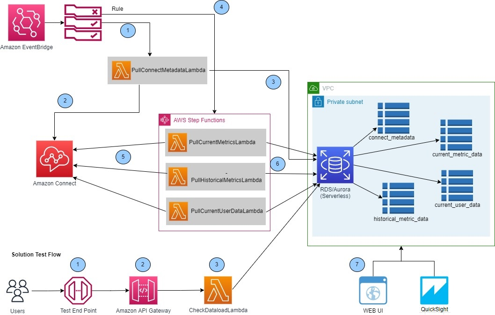

# Visualize Amazon Connect API Data Using Aurora and Quicksight Workshop

## Overview
[Amazon Connect](https://aws.amazon.com/connect/) provides built-in [reports](https://docs.aws.amazon.com/connect/latest/adminguide/amazon-connect-metrics.html), however some customers need more flexibility or need to use a Business Intelligence (BI) tool to visualize Amazon Connect data. Customers may also like to use custom calculations that are defined by their business which are not available in the out-of-the-box Amazon Connect Reports. In this workshop, you will learn how to use Amazon Connect APIs along with other Amazon services like [Amazon Aurora](https://aws.amazon.com/rds/aurora/) and [Amazon QuickSight](https://aws.amazon.com/quicksight/) to store Contact Center data and create visualization.

This workshop uses Amazon Connect APIs as data source to generate meaningful contact center statistics.

### Intended Audience
This workshop is designed for Contact Center Developers, Administrators, and Analysts who want to build dashboards and reports for analyzing contact center performance.

### Solution Approach
In this workshop, you will learn how to use data from Amazon Connect APIs along with other Amazon services like [Amazon Aurora](https://aws.amazon.com/rds/aurora/) and [Amazon QuickSight](https://aws.amazon.com/quicksight/) to store Contact Center data and create visualization. This data can then be used by the external BI tools to create advanced visualizations.
1. Retrieve real-time and historical data from Amazon Connect instance using the Amazon Connect [APIs](https://docs.aws.amazon.com/connect/latest/APIReference/Welcome.html).
1. [Amazon Event Bridge](https://aws.amazon.com/eventbridge/) rule along with [AWS Step Function](https://aws.amazon.com/step-functions/) periodically invokes the Amazon Connect APIs and store the results in an [Amazon Aurora Database](https://aws.amazon.com/rds/aurora/).
1. Amazon Connect APIs used in this workshop:
    - [GetCurrentMetricData](https://docs.aws.amazon.com/connect/latest/APIReference/API_GetCurrentMetricData.html)
    - [GetMetricData](https://docs.aws.amazon.com/connect/latest/APIReference/API_GetMetricData.html)
    - [GetCurrentUserData](https://docs.aws.amazon.com/connect/latest/APIReference/API_GetCurrentUserData.html)
    - [ListQueues](https://docs.aws.amazon.com/connect/latest/APIReference/API_ListQueues.html)
    - [ListRoutingProfiles](https://docs.aws.amazon.com/connect/latest/APIReference/API_ListRoutingProfiles.html)
    - [ListAgentStatuses](https://docs.aws.amazon.com/connect/latest/APIReference/API_ListAgentStatuses.html)
    - [ListUsers](https://docs.aws.amazon.com/connect/latest/APIReference/API_ListUsers.html)
1. Visualize the historical data using Amazon QuickSight .

### Prerequisites
1. You need to have an AWS account with programmatic access
1. An Amazon Connect Instance with Administrator Access
1. A 200 level knowledge of [Amazon Connect](https://aws.amazon.com/connect/)
1. Identity and Access Management [(IAM)](https://aws.amazon.com/iam/) access to create policies and roles to deploy infrastructure as a code using AWS CDK
1. If you do not have an AWS Account and/or an Amazon Connect instance, you may follow this [workshop](https://catalog.workshops.aws/amazon-connect-bootcamp/en-US) to create one.
1. To get the most out of this workshop, we recommend attendees have fundamental knowledge of the following AWS services:
    - [Amazon S3](https://aws.amazon.com/s3/faqs/)
    - [AWS Lambda](https://aws.amazon.com/lambda/faqs/)
    - [Amazon Aurora](https://aws.amazon.com/rds/aurora/faqs/)
    - [Amazon QuickSight](https://aws.amazon.com/quicksight/resources/faqs/)
    - [AWS CLI](https://aws.amazon.com/cli/)
    - [AWS CloudFormation](https://aws.amazon.com/cloudformation/faqs/)
    - [Cloud Development Kit](https://docs.aws.amazon.com/cdk/v2/guide/home.html)
    - [AWS Identity and Access Management (IAM)](https://aws.amazon.com/iam/)
1. Familiarity with the below concepts:
    - [Git Bash](https://git-scm.com/docs/gitfaq) 
    - [TypeScript](https://www.typescriptlang.org/)
1. User must have following software installed:
    - [NodeJS](https://nodejs.org/en/download)
    - [AWS CLI](https://docs.aws.amazon.com/cli/latest/userguide/getting-started-install.html)
    - [AWS CDK](https://docs.aws.amazon.com/cdk/v2/guide/getting_started.html)
    - [Git Client](https://git-scm.com/downloads)

### Estimated time required to complete the workshop
5 hours 

### Costs
The estimated cost is $3 or $25 (Amazon QuickSight Enterprise Edition  has a free trial for authors. You will need to pay for Amazon QuickSight if your trial has expired).

### AWS Regions
This workshop can only be run in regions that support Amazon Connect 

### Out of Scope
Any integration with Third Party BI Tool or web interfaces to visualize the data are not discussed as part of this workshop

## Solution Architecture
- The solution utilizes two types of data:
  - **Metadata**    : Data describes various contact center configuration. 
  - **Metric Data** : Real time and historical data for your contact center metrics.    

### Solution Flow
1. An [Amazon Event Bridge](https://aws.amazon.com/eventbridge/) rule runs every 15 minutes to invoke an AWS Lambda function.
1. The lambda function invokes [ListQueues](https://docs.aws.amazon.com/connect/latest/APIReference/API_ListQueues.html), [ListRoutingProfiles](https://docs.aws.amazon.com/connect/latest/APIReference/API_ListRoutingProfiles.html), [ListAgentStatuses](https://docs.aws.amazon.com/connect/latest/APIReference/API_ListAgentStatuses.html), and [ListUsers](https://docs.aws.amazon.com/connect/latest/APIReference/API_ListUsers.html) API's to get the ARN, Name of the connect resource (e.g., queue, agent status, routing profiles).
1. The data is then stored in an Aurora Database table.
1. Three different [Amazon Event Bridge](https://aws.amazon.com/eventbridge/) rule invoke three different step functions every one minute.
1. Each step function invokes a corresponding lambda functions every 10 seconds(6 times in one minute)
1. Each lambda function invokes the respective metrics related API's to fetch data from Amazon Connect instance.
*Exponential Backoff is implemented in the lambda functions to avoid [API throttling](https://docs.aws.amazon.com/connect/latest/adminguide/amazon-connect-service-limits.html#connect-api-quotas)*. The API response are then saved into Aurora database in different tables.
1. Amazon Quicksight is used to visualize the historical data.

>>Note : You can change the frequency of the Step Function according to your need but make sure you do not hit the API threshold limit. 

### Solution Test Flow
1. A user can invoke an API gateway endpoint to check that the data is getting updated in the database.
1. The endpoint sends the request to an [Amazon API Gateway](https://aws.amazon.com/api-gateway/).
1. The API Gateway in turn sends the request to checkDataLoad lambda function which queries the database for updates and return the results.

### Amazon Connect API Usage 
This workshop utilizes the Amazon Connect API's programmatically using AWS SDK for JavaScript

1. **GetMetricData API** retrieves the historical metrics for Amazon Connect instance. More Details of the API usage is described [here](https://docs.aws.amazon.com/AWSJavaScriptSDK/latest/AWS/Connect.html#getMetricData-property). The data retrieved is stored is stored in the Aurora Database.
    - Some metrics report the average value but do not provide the count that was used to create the average value.  HOLD_TIME is one example.  The API does not report the number of contacts put on hold.  This prevents us from performing a weighted average across intervals.  If weighted averages are important, then you need to use contact trace record data.  Contact trace records provide details about each call (e.g., NumberOfHolds, CustomerHoldDuration). Refer [this workshop](https://studio.us-east-1.prod.workshops.aws/preview/607718a8-cddd-416a-97b4-4fc9dc93ff7a/builds/4b6cffd2-a4f3-49f5-b2d2-70eadada9e95/en-US).
    - The average metrics from this API are good for histograms, which show general distributional features of dataset variables. You can see where the peaks of the distribution are, whether the distribution is skewed or symmetric, and if there are any outliers.
    - 5 minute intervals are the shortest period supported by the API and was selected to provide the highest resolution.  
    - The API can only query the past 24 hours, which is why we are saving the data.

1. **GetCurrentMetricData API** retrieves the metrics in real time from the Amazon Connect instance. More details of the API usage are described [here](https://docs.aws.amazon.com/AWSJavaScriptSDK/latest/AWS/Connect.html#getCurrentMetricData-property). A new set of data is is received every 10 seconds. 

1. **GetCurrentUserData API** retrieves the agent related information in real time from the Amazon Connect instance. More details of the API usage are described [here](https://docs.aws.amazon.com/AWSJavaScriptSDK/latest/AWS/Connect.html#getCurrentUserData-property)

1. **ListQueues API** retrieves the list of the standard queues from the Amazon Connect instance. This data is considered as part of Metadata for Amazon Connect in this workshop. More details of the API usage are described [here](https://docs.aws.amazon.com/AWSJavaScriptSDK/latest/AWS/Connect.html#listQueues-property)

1. **ListRoutingProfiles API** retrieves the list of the routing profile configured in the Amazon Connect instance. This data is considered as part of Metadata for Amazon Connect in this workshop. More details of the API usage are described [here](https://docs.aws.amazon.com/AWSJavaScriptSDK/latest/AWS/Connect.html#listRoutingProfiles-property)

1. **ListAgentStatuses API** retrieve the list of the Agent Status's configured in the Amazon Connect instance. This data is considered as part of Metadata for Amazon Connect in this workshop. More details of the API usage are described [here](https://docs.aws.amazon.com/AWSJavaScriptSDK/latest/AWS/Connect.html#listAgentStatuses-property)

1. **ListUsers API** retrieves the list of users from the Amazon Connect instance. This data is considered as part of Metadata for Amazon Connect in this workshop. More details of the API usage are described [here](https://docs.aws.amazon.com/AWSJavaScriptSDK/latest/AWS/Connect.html#listUsers-property)
